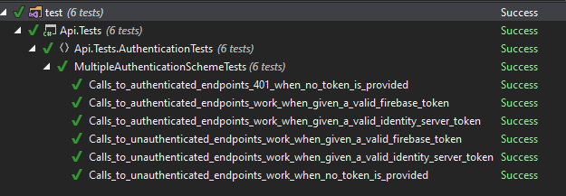

# Multiple Authentication Providers Experiment

This repository contains the source for a quick experiment in getting
multiple authentication providers to work for a protected resource at
the same time, dynamically at runtime. Motivation is needing to do a
staged migration from one identity provider to another.

## Focus

* Does it work (and what is the simplest/most secure way to make it work)
* Is there a good way to test it? (Currently using integration tests,
but I'm not sure if I like using real identity providers. Transient
test failures thanks to e.g. rate limits or network drops would suck.
Local development experience would probably suck. Maybe providing
custom AuthenticationHandler/AuthorizationHandlers?)

The authorities used here are:

* A local IdentityServer4 server
* Firebase authentication

## Results

Requirements:

1. Specify your default scheme in `AddAuthentication`
2. Authentication configured via `AuthenticationBuilder` using unique
schemes for each authority. One must match the default in step 1
3. Register each scheme by configuring `AddAuthorization`

See `Startup.cs` for specifics

Test results:

